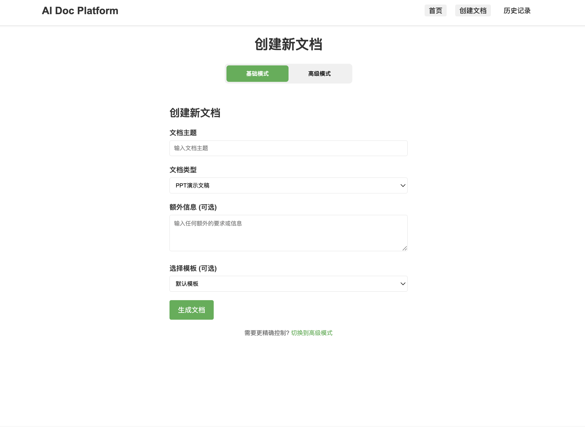
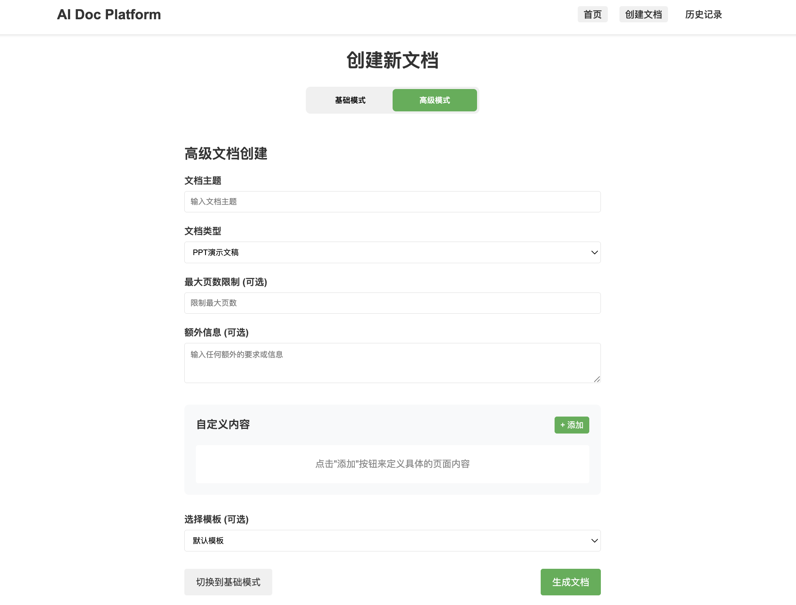
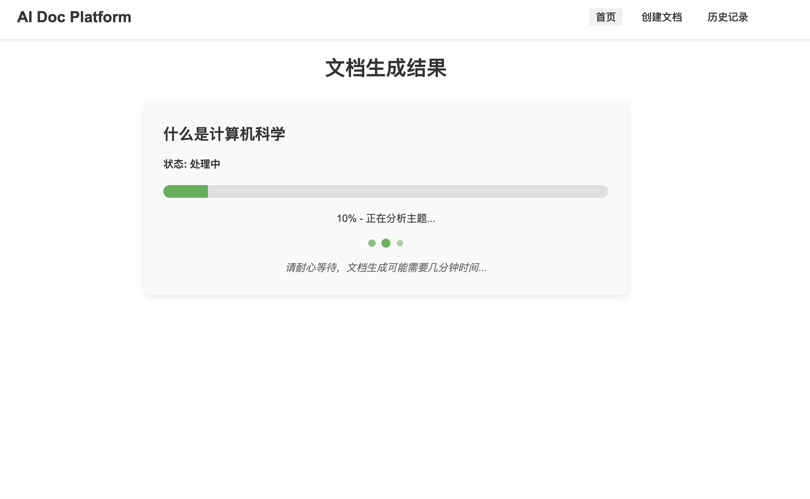
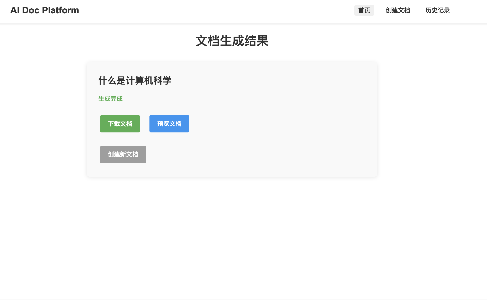

# AI 文档生成器

一个基于 AI 的文档生成系统，可以根据用户提供的主题自动生成 PPT 和 Word 文档。

目前是初始版本，正在开发中。。。。


## 功能特点

- 根据主题自动生成文档大纲
- 支持 PPT 和 Word 文档格式
- 实时显示生成进度
- 支持文档下载和预览
- 使用 Server-Sent Events (SSE) 实现实时进度更新
- **新增：高级文档创建功能，可自定义页数限制和具体内容**

## 效果展示

### 创建文档界面





### 文档生成界面



### 生成结果



### 样本文档

我们提供了一些由系统生成的样本文档，您可以查看以了解系统的能力：

- [PPT 样本：量化投资：寻找阿尔法因子](images/量化投资：寻找阿尔法因子_presentation.pptx)
- [Word 样本：强化学习](images/强化学习_document.docx)

## 技术栈

### 前端
- Vue.js
- Vuex
- Vue Router
- Axios

### 后端
- FastAPI
- Python-docx (Word 文档生成)
- Python-pptx (PPT 生成)
- DeepSeek API (AI 内容生成)


## 环境变量

创建一个 `.env` 文件在后端目录中：

```
AI_API_KEY=your_deepseek_api_key
AI_API_ENDPOINT=https://api.deepseek.com/v1/chat/completions
```

## 安裝与运行

```bash
docker pull ubuntu:20.04
docker compose build
docker compose up -d
```
浏览器登陆: localhost:3000

## 使用流程

1. 在首页点击"创建新文档"按钮
2. 选择基础模式或高级模式：
   - **基础模式**：只需输入主题和文档类型
   - **高级模式**：可以设置页数限制和自定义每页/章节内容
3. 填写文档主题（如"人工智能"、"区块链"等）
4. 选择文档类型（PPT 或 Word）
5. 可选：添加额外信息或选择模板
6. 点击"生成文档"按钮
7. 等待文档生成完成（您可以实时查看进度）
8. 下载或预览生成的文档


## 更新日志

### 2025-03-22
- 新增高级文档创建功能，允许用户限制页数和自定义具体内容, 优化ppt内容生成的格式

### 2025-03-21
- 更新了安装和运行改为docker部署, 对代码进行重构
### 2025-03-07
- 这周比较忙，继续更新项目，让AI能够生成更好的ppt内容，目前只使用了deepseek的api。

## 许可证
[MIT](LICENSE)
